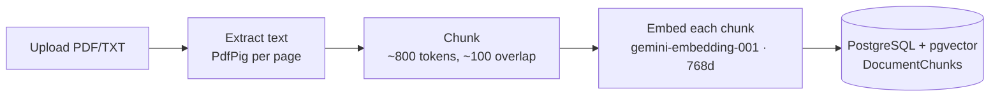
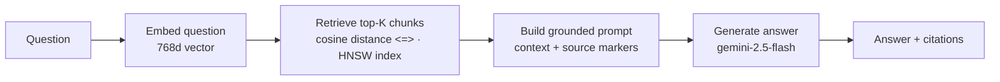
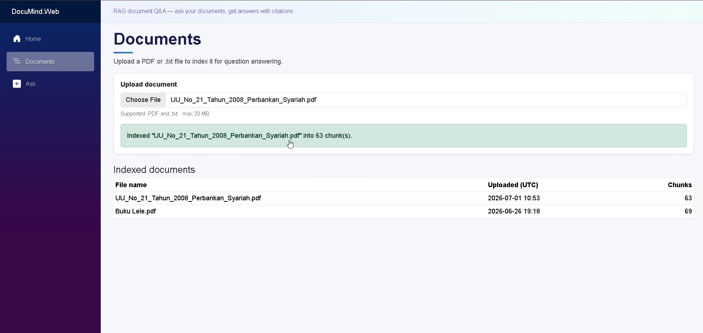
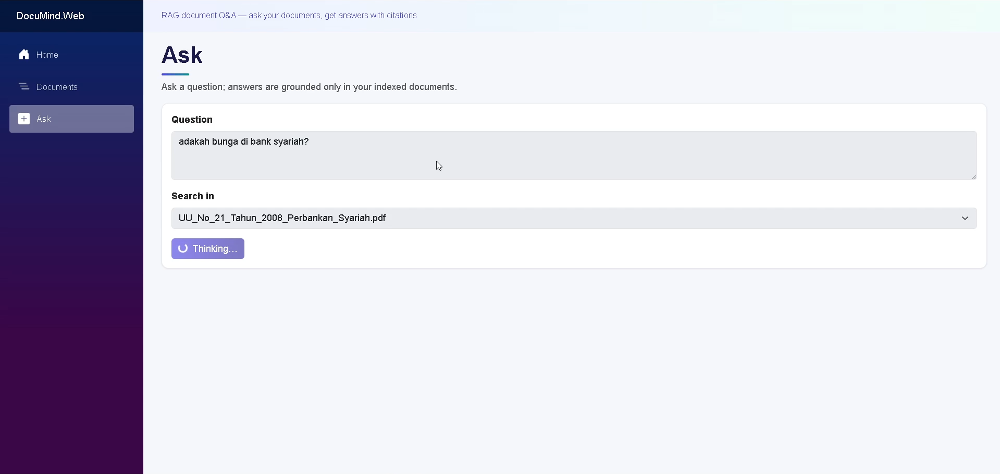
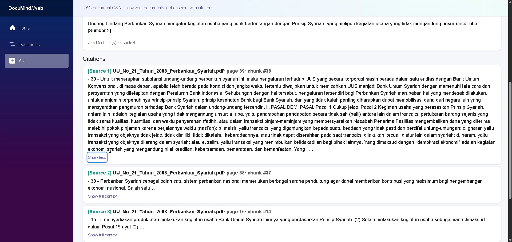

# DocuMind

**Ask your documents questions and get answers with citations — grounded in your own files, not the model's imagination.**

DocuMind is a Retrieval-Augmented Generation (RAG) document Q&A application built on .NET 10 and Blazor Server.


## Problem

Large language models are fluent but unreliable on private or domain-specific content: they don't know your documents, and when asked anyway they tend to hallucinate confident-but-wrong answers. Reading long PDFs by hand to find one fact is slow.

DocuMind solves this by grounding answers in *your* documents. You upload files; DocuMind indexes them into a vector database; when you ask a question it retrieves the most relevant passages and asks the LLM to answer **only** from those passages — and to say so honestly when the answer isn't there. Every answer comes back with citations to the source file and page, so you can verify it.

## Features

- 📄 **Document ingestion** — upload PDF or plain-text files; text is extracted (per page for PDFs), chunked, embedded, and stored.
- 🔎 **Semantic retrieval** — questions are embedded and matched against chunks using pgvector cosine similarity with an HNSW index.
- 💬 **Answers with citations** — responses are grounded strictly in retrieved context and include source markers (file name, page, snippet) with an expandable full-context view.
- 🚫 **Honest "not found"** — a firm system prompt makes the model admit when the answer isn't in the documents instead of hallucinating.
- 🧱 **Clean architecture** — domain/abstractions in Core, implementations in Infrastructure, thin Blazor/API host in Web.
- 🛡️ **Production-minded resilience** — retry with exponential backoff for rate limits/transient failures, timeouts, input validation, and friendly error handling (no stack traces leak to users).
- 🧪 **Built-in evaluation harness** — a small runner scores retrieval and answer accuracy over a question set.

## Architecture

Three projects, dependencies pointing inward to `Core`:

| Project | Responsibility |
| --- | --- |
| `DocuMind.Core` | Domain models, service interfaces, abstractions (no external dependencies). |
| `DocuMind.Infrastructure` | EF Core `DbContext`, pgvector access, Gemini clients, ingestion & RAG implementations. |
| `DocuMind.Web` | Blazor Server UI + minimal API endpoints; composition root. |

### Ingestion flow



### Query flow



**Retrieval** uses pgvector's cosine distance operator (`<=>`) over the `Embedding vector(768)` column, ordered ascending and limited to top-K. The column is backed by an **HNSW** index with `vector_cosine_ops`, so nearest-neighbour search stays fast (approximate, ~O(log n)) and the operator matches the index's operator class. Cosine is chosen because text-embedding similarity lives in vector *direction*, not magnitude.

## Tech stack

| Layer | Technology |
| --- | --- |
| Runtime | .NET 10 |
| UI | ASP.NET Core + Blazor Server |
| AI abstraction | Microsoft.Extensions.AI (`IChatClient`, `IEmbeddingGenerator`) |
| LLM | Google Gemini — `gemini-2.5-flash` (chat) via its OpenAI-compatible endpoint |
| Embeddings | Google Gemini — `gemini-embedding-001` (768 dimensions) |
| Database | PostgreSQL + `pgvector` (HNSW, cosine) |
| Data access | EF Core 10 (Npgsql) |
| PDF parsing | PdfPig |
| Resilience | Microsoft.Extensions.Http.Resilience (Polly) |

## Getting started

### Prerequisites

- [.NET 10 SDK](https://dotnet.microsoft.com/download)
- [Docker Desktop](https://www.docker.com/products/docker-desktop/) (for PostgreSQL + pgvector)
- A [Google Gemini API key](https://aistudio.google.com/app/apikey) (free tier works)

### 1. Start the database

```bash
docker compose up -d
```

This runs PostgreSQL 17 with pgvector (container `documind-db`) on host port **5433** and enables the `vector` extension on first startup.

### 2. Configure the Gemini API key

The key is read from configuration and never committed. Set it once with user-secrets (it persists across runs):

```bash
dotnet user-secrets set "Gemini:ApiKey" "<your-gemini-api-key>" --project src/DocuMind.Web
```

### 3. Apply database migrations

```bash
dotnet ef database update -p src/DocuMind.Infrastructure -s src/DocuMind.Infrastructure
```

> Requires the EF Core tools: `dotnet tool install --global dotnet-ef` (once).

### 4. Run

```bash
dotnet run --project src/DocuMind.Web
```

Open the URL shown in the console (default `http://localhost:5194`). A connectivity check is available at `GET /health/ai` (should return `vectorLength: 768`).

## Usage

1. Go to **Documents** (`/documents`), choose a PDF or `.txt` file, and upload it. Wait for the success message; the file appears in the indexed-documents table with its chunk count.

   

2. Go to **Ask** (`/ask`), type a question, optionally restrict the search to one document, and click **Ask**. The grounded answer appears with citations; expand any citation to read the full source context.

   

3. Out-of-scope questions are answered honestly with "not found in the documents".

   

API endpoints are also available (see Swagger at `/swagger` in Development): `POST /api/documents` (multipart upload) and `POST /api/ask` (`{ question, topK?, documentId? }`).

## Evaluation

DocuMind ships with a small evaluation harness in [`eval/`](eval/) that measures two things over a set of questions:

- **Retrieval accuracy** — did the expected document appear in the answer's citations?
- **Answer accuracy** — does the answer contain the expected keywords?

Edit [`eval/questions.json`](eval/questions.json) to match your own documents, then run:

```bash
# Make sure the DB is up, the API key is set, and your documents are ingested first.
dotnet run --project eval/DocuMind.Eval
```

It prints per-question results and a summary like `Retrieval: 8/10 · Answer: 7/10`.

## Limitations

This is an intentional MVP. Known, deliberate trade-offs:

- **Answer quality depends on chunking.** A fixed ~800-token / ~100-overlap, sentence-aware strategy is a reasonable default but not tuned per document type; poor extraction (e.g. scanned PDFs without OCR) yields poor answers.
- **Free-tier rate limits.** Gemini's free tier rate-limits requests; large uploads embed in throttled batches and may still hit `429` (handled with retry/backoff, but slow).
- **No authentication / multi-tenancy.** All documents are shared in one database; there is no user login or per-user isolation.
- **Small evaluation set.** The eval harness is a smoke test of relevance, not a rigorous benchmark; keyword matching is a coarse proxy for correctness.
- **No re-ranking or query rewriting.** Retrieval is a single vector search; there's no hybrid (keyword + vector) search, re-ranker, or multi-step reasoning.
- **PDF text only.** Images, tables, and complex layouts are flattened to text; non-text content isn't understood.

These are scoping decisions to keep the project focused and reviewable, not oversights.

## License

[MIT](LICENSE).

## Acknowledgements

- [Microsoft.Extensions.AI](https://learn.microsoft.com/dotnet/ai/) for the provider-agnostic AI abstractions.
- [pgvector](https://github.com/pgvector/pgvector) and [pgvector-dotnet](https://github.com/pgvector/pgvector-dotnet) for vector search in PostgreSQL.
- [PdfPig](https://github.com/UglyToad/PdfPig) for PDF text extraction.
- [Google Gemini](https://ai.google.dev/) for the chat and embedding models.
