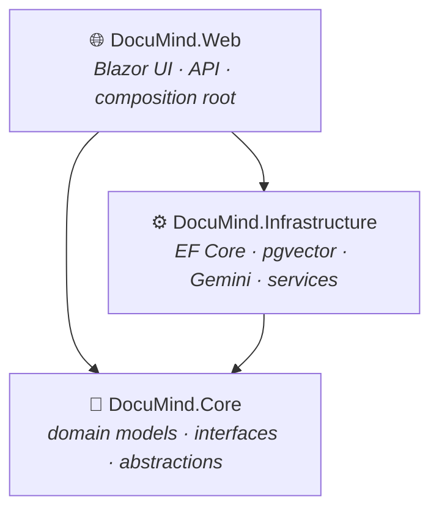
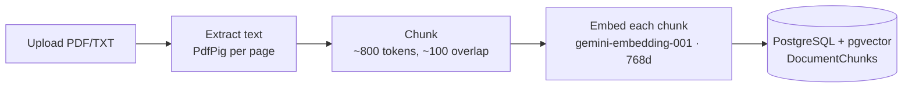
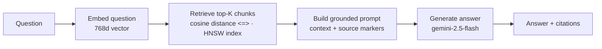

<div align="center">

# 📄 DocuMind

### Ask your documents questions — get answers **with citations**, grounded in your own files, not the model's imagination.

A production-minded **Retrieval-Augmented Generation (RAG)** document Q&A app built end-to-end on **.NET 10** and **Blazor Server**.


</div>

---

## Why this project?

LLMs are fluent but unreliable on *your* private content: they don't know your documents, and when asked anyway they hallucinate confident-but-wrong answers. Reading long PDFs by hand to find one fact is slow.

**DocuMind grounds every answer in your documents.** Upload files → they're indexed into a vector database → ask a question → the app retrieves the most relevant passages and asks the LLM to answer **only** from those passages, citing the source file and page. When the answer isn't in your documents, it says so honestly instead of making something up.

## What this project demonstrates

> Built as a portfolio piece to show an end-to-end, production-minded AI feature — not just a prompt in a loop.

- **Full RAG pipeline** — ingestion → chunking → embeddings → vector search → grounded generation with citations.
- **Vector search in PostgreSQL** — `pgvector` with an **HNSW** index and **cosine** distance, queried through EF Core.
- **Provider-agnostic AI** — coded against `Microsoft.Extensions.AI` (`IChatClient` / `IEmbeddingGenerator`); Gemini is swappable.
- **Clean architecture** — domain/abstractions in `Core`, implementations in `Infrastructure`, thin host in `Web`.
- **Production concerns, not just a demo** — retry/backoff, timeouts, input validation, structured logging, graceful error handling, and partial-failure tolerance.
- **Evaluation mindset** — a small harness that scores retrieval and answer accuracy, so quality is measured, not assumed.

## Contents

- [Features](#features)
- [Architecture](#architecture)
- [Tech stack](#tech-stack)
- [Quick start](#quick-start)
- [Usage](#usage)
- [Engineering decisions](#engineering-decisions)
- [Evaluation](#evaluation)
- [Limitations](#limitations)
- [License](#license)

## Features

- 📄 **Document ingestion** — upload PDF or plain-text files; text is extracted (per page for PDFs), chunked, embedded, and stored.
- 🔎 **Semantic retrieval** — questions are embedded and matched against chunks using pgvector cosine similarity with an HNSW index.
- 💬 **Answers with citations** — responses are grounded strictly in retrieved context and include source markers (file name, page, snippet) with an expandable full-context view.
- 🚫 **Honest "not found"** — a firm system prompt makes the model admit when the answer isn't in the documents instead of hallucinating.
- 🧱 **Clean architecture** — clear separation between domain, infrastructure, and host.
- 🛡️ **Production-minded resilience** — exponential-backoff retry for rate limits/transient failures, timeouts, validation, and friendly errors (no stack traces reach users).
- 🧪 **Built-in evaluation harness** — scores retrieval and answer accuracy over an editable question set.

## Architecture

Three projects following clean/onion architecture — every dependency points **inward** to `Core`, so the domain has zero external dependencies and the AI/DB providers stay swappable:



| Project | Responsibility |
| --- | --- |
| `DocuMind.Core` | Domain models, service interfaces, abstractions (no external dependencies). |
| `DocuMind.Infrastructure` | EF Core `DbContext`, pgvector access, Gemini clients, ingestion & RAG implementations. |
| `DocuMind.Web` | Blazor Server UI + minimal API endpoints; composition root. |

**Ingestion** — how a document becomes searchable:



**Query** — how a question becomes a grounded answer:



### Retrieval in code

The embedding column and its ANN index are configured once in the `DbContext`:

```csharp
// DocuMindDbContext — store embeddings as vector(768), indexed for cosine search
entity.Property(c => c.Embedding)
      .HasColumnType($"vector({DocumentChunk.EmbeddingDimensions})"); // vector(768)

entity.HasIndex(c => c.Embedding)
      .HasMethod("hnsw")
      .HasOperators("vector_cosine_ops");
```

Retrieval is then a single strongly-typed EF Core query — no raw SQL. Ordering by `CosineDistance` translates to pgvector's `<=>` operator and uses the HNSW index:

```csharp
// RagService — top-K nearest chunks by cosine distance, optionally scoped to one document
var hits = await chunks
    .OrderBy(c => c.Embedding!.CosineDistance(query))  // → ORDER BY embedding <=> :query  (HNSW)
    .Take(topK)
    .Select(c => new RetrievedChunk(
        c.DocumentId, c.Document.FileName, c.ChunkIndex,
        c.PageNumber, c.Content,
        c.Embedding!.CosineDistance(query)))
    .ToListAsync(cancellationToken);
```

## Tech stack

| Layer | Technology |
| --- | --- |
| Runtime | .NET 10 |
| UI | ASP.NET Core + Blazor Server |
| AI abstraction | Microsoft.Extensions.AI (`IChatClient`, `IEmbeddingGenerator`) |
| LLM | Google Gemini — `gemini-2.5-flash` (chat) via its OpenAI-compatible endpoint |
| Embeddings | Google Gemini — `gemini-embedding-001` (768 dimensions) |
| Database | PostgreSQL + `pgvector` (HNSW, cosine) |
| Data access | EF Core 10 (Npgsql) |
| PDF parsing | PdfPig |
| Resilience | Microsoft.Extensions.Http.Resilience (Polly) |

## Quick start

> **Prerequisites:** [.NET 10 SDK](https://dotnet.microsoft.com/download), [Docker Desktop](https://www.docker.com/products/docker-desktop/), and a [Google Gemini API key](https://aistudio.google.com/app/apikey) (free tier works).

```bash
# 1. Start PostgreSQL + pgvector (container documind-db, host port 5433)
docker compose up -d

# 2. Configure your Gemini API key (stored via user-secrets, never committed)
dotnet user-secrets set "Gemini:ApiKey" "<your-gemini-api-key>" --project src/DocuMind.Web

# 3. Create the schema
dotnet ef database update -p src/DocuMind.Infrastructure -s src/DocuMind.Infrastructure

# 4. Run
dotnet run --project src/DocuMind.Web
```

Open the URL shown in the console (default `http://localhost:5194`). Sanity-check the AI connection at `GET /health/ai` — it should return `vectorLength: 768`.

> First time only: `dotnet tool install --global dotnet-ef` for the EF Core CLI.

## Usage

1. **Upload** a PDF or `.txt` on the **Documents** page. It's indexed and appears in the table with its chunk count.

   

2. **Ask** a question on the **Ask** page — optionally scoped to one document. The grounded answer appears with citations; expand any citation to read the full source context.

   

3. **Out-of-scope questions** are answered honestly with "not found in the documents" instead of a hallucination.

   

An HTTP API is also available (Swagger at `/swagger` in Development): `POST /api/documents` (multipart upload) and `POST /api/ask` (`{ question, topK?, documentId? }`).

## Engineering decisions

A few choices worth calling out, with the reasoning behind them:

- **Cosine distance + HNSW index.** Text-embedding similarity lives in vector *direction*, not magnitude, so cosine is the right metric. Retrieval uses pgvector's `<=>` operator over a `vector(768)` column, backed by an **HNSW** index with `vector_cosine_ops` — approximate nearest-neighbour search stays fast (~O(log n)) and the query operator matches the index's operator class so the index is actually used.
- **~800-token chunks with ~100-token overlap.** Large enough to hold a coherent idea for a sharp embedding, small enough to stay precise; the overlap prevents facts that straddle a chunk boundary from becoming unretrievable. Chunking is sentence-aware to avoid cutting mid-thought.
- **Grounding over fluency.** A firm system prompt forbids answering outside the retrieved context and requires citations — the main defence against hallucination.
- **Resilience by design.** Gemini calls go through a Polly resilience pipeline (retry with exponential backoff + jitter for `429`/transient errors, timeouts, circuit breaker). Ingestion tolerates partial embedding failures and aborts fast on quota exhaustion with a clear message rather than silently dropping content.

## Evaluation

Quality is measured, not assumed. The harness in [`eval/`](eval/) runs the real RAG pipeline over a question set and reports two metrics:

- **Retrieval accuracy** — did the expected document appear in the answer's citations?
- **Answer accuracy** — does the answer contain the expected keywords?

Edit [`eval/questions.json`](eval/questions.json) to match your own documents, then run:

```bash
# DB up, API key set, and your documents ingested first.
dotnet run --project eval/DocuMind.Eval
```

Output is per-question results plus a summary like `Retrieval: 8/10 · Answer: 7/10`.

## Limitations

An intentional MVP — these are deliberate scoping decisions, not oversights:

- **Answer quality depends on chunking & extraction.** The fixed chunking strategy isn't tuned per document type, and scanned PDFs without OCR extract poorly.
- **Free-tier rate limits.** Gemini's free tier throttles requests; large uploads embed in batches and can hit `429` (handled with retry/backoff, but slow).
- **No authentication / multi-tenancy.** All documents share one database; there's no login or per-user isolation.
- **Small evaluation set.** The harness is a relevance smoke test, not a rigorous benchmark; keyword matching is a coarse proxy for correctness.
- **Single-stage retrieval.** No hybrid (keyword + vector) search, re-ranking, or query rewriting.
- **Text-only.** Images, tables, and complex layouts are flattened to text.

**Natural next steps:** hybrid search + a re-ranker, OCR for scanned PDFs, streaming answers, authentication, and a larger evaluation set.

## License

[MIT](LICENSE) — free to use, learn from, and build on.

## Acknowledgements

- [Microsoft.Extensions.AI](https://learn.microsoft.com/dotnet/ai/) — provider-agnostic AI abstractions.
- [pgvector](https://github.com/pgvector/pgvector) & [pgvector-dotnet](https://github.com/pgvector/pgvector-dotnet) — vector search in PostgreSQL.
- [PdfPig](https://github.com/UglyToad/PdfPig) — PDF text extraction.
- [Google Gemini](https://ai.google.dev/) — chat and embedding models.
